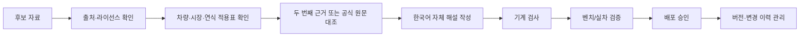

# 차량 진단 지식 데이터 확보 조사

조사 기준일: 2026-09-12
대상 제품: Serotonin 범용 OBD
우선 차량: 대한민국 판매 2019 Nissan LEAF ZE1, 2019 Kia Niro EV DE, 현대·기아 내연기관

## 결론

현재 앱의 오프라인 해설은 105건이고 자동으로 증가하지 않는다. 105개 해설과 34개 근거 문서·표준 메타데이터에 출처 ID, 근거 등급, 권리 상태를 연결하고 빌드 때 검사한다. 이 가운데 102건은 공통 OBD 코드, 3건은 제조사 전용 코드다. 현대·기아·닛산, GM, 크라이슬러, 포드, 혼다, 토요타, Volkswagen, Audi, Subaru의 공개 정비 사례를 포함한다. 공통 코드라도 연결된 정비 공지의 사례는 해당 차종·연식·판매지역에만 적용되도록 별도 범위로 표시한다.

차량 카탈로그 리비전 2는 위 원장 중 적용 범위가 명확한 북미 현대·기아 공지 4건을 판매 지역·연식·세대·동력계·엔진 조건으로 연결한다. 이는 특정 DTC 사례와 차량 조건의 일치이며 해당 차량 전체 진단 지원을 뜻하지 않는다. 대한민국 판매 차량은 북미 항목에 자동 연결하지 않는다.

차량 카탈로그 리비전 3은 대한민국 현대·기아 주요 36개 모델 계열을 검증 자료 수집 단위로 분리한다. 모델명 일치는 세대·엔진·변속기·ECU 지원 근거가 아니며 모든 계열의 초기 상태는 `실차 검증 자료 모집 중`이다. 이후 기록은 계열 ID 아래에서 세부 사양별로 나눠 검토한다.

상용화에 가장 적합한 순서는 다음과 같다.

1. **SAE 표준 데이터로 공통 OBD 기반을 구축한다.** SAE J2012-DA의 최신 DTC 표와 J1979-DA의 PID 레지스트리를 정식 구매하고, 제품 내 표시·번역·오프라인 탑재 권한을 별도로 확인한다.
2. **Autodata와 TecAlliance에 기업용 API 견적을 동시에 요청한다.** Autodata는 소비자 앱 사용 사례를 공식 API 안내에서 직접 언급하고, TecRMI는 차량별 정비·배선·공임과 실정비 검증 사례 API를 제공한다. 한국 판매 사양과 Nissan/Hyundai/Kia EV의 고전압 진단 범위가 실제 계약 데이터에 포함되는지가 선정 기준이다.
3. **Nissan TechInfo와 Hyundai/Kia 공식 포털은 검증용 좌석으로 사용한다.** 일반 열람 구독은 담당 정비사가 원문을 대조하는 용도다. 그 구독만으로 문서·그림·DTC 설명을 앱에 복제할 권리가 생기지는 않는다.
4. **한국 자동차리콜센터 API를 리콜 확인에 연동한다.** DTC 해설 DB가 아니라 차량별 안전조치 확인용 데이터로 분리한다. 현재 베타이며 사전 협의가 필요하다.
5. **오픈소스 CAN 자료는 후보 신호를 찾는 데만 쓴다.** 실차 재현, 제조사·연식·ECU 식별, 범위·단위 검증과 라이선스 검토를 통과한 항목만 읽기 기능에 반영한다.

유출 매뉴얼, 비공식 판매 PDF, 다크웹 자료는 데이터 원천에서 제외한다. 출처와 변경 이력을 확인할 수 없고, 악성 파일·위조·누락 위험이 있으며, 앱 배포 권리를 입증할 수도 없다.

## 확인된 지원 경계

표준 OBD와 제조사 진단을 같은 데이터로 취급하면 안 된다. ISO 15031-6은 표준 DTC 형식과 SAE J2012-DA의 표준 코드 집합을 연결한다.[^1] SAE J1979는 법규상 배출가스 관련 OBD와 외부 시험 장비 간 통신 범위를 다룬다.[^2] 따라서 P0 계열 공통 코드와 법정 PID는 범용화할 수 있지만, 같은 차의 ABS·에어백·차체·고전압 배터리 ECU까지 자동으로 포괄하지 않는다.

UDS는 더 넓은 ECU 진단 서비스를 정의한다. 최신 ISO 14229-1:2026에는 실시간 값과 DTC의 읽기·삭제뿐 아니라 액추에이터와 루틴 제어까지 포함된다.[^3] 그러나 표준이 서비스의 형식을 정할 뿐, 각 제조사의 ECU 주소, 데이터 식별자, 보안 접근, 차량별 의미를 공개하는 것은 아니다. 이 앱은 검증된 읽기와 안전 절차를 거친 삭제만 다루고 액추에이터 제어·보안 우회·코딩은 구현하지 않는다.

전기차의 SOC·SOH·셀 전압도 같은 경계가 적용된다. SOC는 현재 충전량의 추정치이고 SOH는 BMS가 추정한 기준 대비 상태값이다. 제조사별 계산식과 보정 조건이 다르므로 서로 다른 차량의 SOH 숫자를 직접 비교하거나, 한 번의 측정으로 잔존 수명·보증 판정을 확정하면 안 된다. 현재 리프와 니로 조회 기능은 공개 프로젝트의 읽기 전용 신호를 바탕으로 한 시험 기능이며 공식 진단기 대조가 남아 있다.

## 자료원별 판단

| 자료원 | 확인된 내용 | 현재 앱에 가능한 사용 | 계약 전 금지/보류 | 우선도 |
|---|---|---|---|---|
| SAE J2012-DA / J1979-DA | 표준 DTC와 규제 OBD 데이터 식별자를 갱신하는 디지털 부록. J2012-DA는 연중 여러 번 갱신된다고 명시한다.[^4] | 정식 구매 후 내부 기준표와 검수 기준으로 사용 | 번역·오프라인 배포·상업 앱 표시 권리를 서면 확인하기 전 원표 수록 | 매우 높음 |
| ISO 15031-6 / 14229-1 | DTC 구조와 UDS 서비스의 공식 규격 | 프로토콜 구현·테스트 기준 | 표준 원문·표를 앱에 복제 | 높음 |
| Nissan TechInfo | 북미 차량용 서비스 매뉴얼·TSB 열람. 1일 35달러, 30일 135달러, 1년 1,250달러로 표시되며 이용권은 구매자 개인에게만 부여된다.[^5] | 리프 항목을 사람이 대조하고 출처·페이지 기록 | 구독 문서·그림을 DB로 추출 또는 재판매 | 매우 높음, 검증 좌석 |
| Hyundai TechInfo | 북미 판매 차량용 매뉴얼·회로·DTC·TSB. 공개 안내 PDF는 1주 40달러, 1개월 60달러, 1년 600달러를 표시한다.[^6] | 현대 북미 사양 검증 | 한국 사양으로 간주, 원문 수록 | 높음, 검증 좌석 |
| Kia TechInfo | 북미 서비스 공지·수리 매뉴얼·진단 정보. 공개 안내 PDF는 72시간 19달러, 1개월 150달러, 1년 1,500달러를 표시한다.[^7] | 기아 북미 사양 검증 | 한국 사양으로 간주, 원문 수록 | 높음, 검증 좌석 |
| Autodata API | 차량 식별, 사양, 정비, 수리 절차, 이미지·도면을 API로 제공하며 소비자 앱 예시와 제조사 라이선스 데이터를 명시한다.[^8] | 계약 범위에 따라 앱 내 차량별 안내 | 가격·한국 사양·EV DTC·오프라인 캐시 권리가 미확인 | **1차 견적** |
| TecAlliance TecRMI | 정비·수리·배선 API, 국가/언어별 응답, 사용자 식별 기반 과금. 검증 수리 사례는 15,000건 이상과 250,000개 이상 fault code를 표시한다.[^9] | 정비사 모드의 차량별 절차·배선·검증 사례 | 소비자 표시·오프라인 저장·한국 데이터 범위 미확인 | **1차 견적** |
| MOTOR DaaS | DTC, 서비스 절차, TSB, 배선도, 차량 식별 API를 명시한다.[^10] | 별도 소비자 앱 계약이 성립할 때 북미 데이터 후보 | 공개 패키지 조건은 소비자 앱을 제외하고 북미·3년 계약을 전제로 설명한다.[^11] | 2차 견적 |
| Mitchell 1 ProDemand | 기업 연동 신청 창구가 있으나 승인형이며 미국·캐나다 내부 목적 제한과 AI/ML·벡터DB 사용 금지를 명시한다.[^12] | 공급사가 승인한 표시 연동만 | 본 앱 지식 DB나 AI 원인 추론의 원천으로 사용 | 낮음 |
| ALLDATA | OEM과 직접 라이선스한 원문 수리 데이터를 제공하며 Hyundai, Kia, Nissan을 지원한다고 밝힌다.[^13] | 한국/소비자 앱 API 권리를 별도 제안받을 경우 재평가 | 일반 정비소 구독을 앱 데이터 라이선스로 간주 | 2차 문의 |
| 자동차리콜센터 | 기간·VIN 기반 리콜 API. 현재 베타이고 사전 협의로 제공 여부를 결정한다.[^14] | 리콜 여부와 공식 조치 링크 | DTC 원인·수리 절차로 변환 | 높음, 별도 기능 |
| NHTSA Recalls/vPIC | 리콜 데이터와 제조사 제출 VIN 해석 API를 제공한다.[^15] | 북미 차량 식별·리콜 보조 | 한국 판매 사양 확정, 정비 절차 대체 | 중간 |
| OVMS | Leaf와 e-Niro를 포함한 차량 모듈, SOC·온도·고장 상태 등을 다루며 MIT 라이선스다. 프로젝트 자체도 다수가 역공학이고 OEM 적합성을 보증하지 않는다고 경고한다.[^16] | 신호 후보 탐색, 라이선스 고지 후 코드 참고 | 단일 출처만으로 정상 범위·수리 판단 | 높음, 실험 근거 |
| comma.ai opendbc | CAN 해석과 차량 포트를 MIT 라이선스로 공개한다.[^17] | 신호 후보·차량 식별 연구 | DTC 정비 절차 DB로 오인, 제어 명령 도입 | 중간 |

표에 적힌 구독 가격은 2026-09-12에 공개 페이지에서 확인한 표시 가격이다. 세금·지역·계정 유형·향후 변경은 반영하지 않으며 실제 구매 전에 공급사 견적과 약관을 다시 확인해야 한다.

## 권장 데이터 구조

각 해설은 코드 문자열 하나가 아니라 다음 키로 식별해야 한다.

```text
manufacturer + market + model + model_year_range + powertrain
+ ecu/system + protocol + full_dtc + failure_type
+ software/calibration range + campaign/TSB applicability
```

내용에는 쉬운 설명, 정비사 설명, 발생 조건, 동반 코드, 필요한 센서 스냅샷, 점검 순서, 중단 조건, 삭제 허용 여부, 수리 후 검증 항목을 분리한다. 모든 문장에는 `source_id`, 원문 판·문서 번호·페이지, 검토일, 검토자, 근거 등급, 배포 권리, 번역 상태가 붙어야 한다.

앱에서 사용하는 권리 상태는 네 가지다.

- `자체 해설·원문 링크만 가능`: 공개 원문을 보고 직접 쓴 제한적 설명만 앱에 수록한다.
- `오픈 라이선스 검토 후 사용`: 저장소 전체와 개별 파일의 라이선스·저작권 고지를 확인한 뒤 사용한다.
- `상업용 데이터 계약 필요`: 계약이 정한 화면, 사용자 수, 지역, 캐시 기간에서만 표시한다.
- `권리 미확인·원문 수록 금지`: 검색 후보로만 보관하고 제품 데이터에서 제외한다.

## 누적 절차

데이터는 아래 상태를 한 단계씩 통과해야 한다.



후보 수와 배포 수를 따로 센다. GitHub 이슈나 실차에서 새 코드를 발견해도 즉시 해설 DB에 들어가지 않는다. 정의를 찾지 못한 P317E-97처럼 `실차 수신 확인 · 정의 미검증`으로 보관하고 부품·원인·정상 여부를 제시하지 않는다.

현재 코드의 `KnowledgeCatalog.audit()`는 출처 ID 중복, 존재하지 않는 출처 참조, 원장과 다른 URL, 대조일 형식, 미검증 항목의 원문 연결을 검사한다. 다음 단계에서는 이 원장을 JSON/SQLite 입력 파이프라인으로 옮기고 아래 검사를 추가해야 한다.

- 코드 형식과 2바이트/3바이트 failure type 분리
- 차종·연식 범위 겹침과 충돌 탐지
- 원문 판이 바뀌었을 때 재검토 대상 표시
- 계약 종료 시 캐시 삭제 또는 비표시
- 한국어 번역 검수자와 승인 시각 기록
- 해설 버전과 진단 보고서 생성 시점의 버전 연결

## 90일 실행안

### 1–2주: 계약 가능성 확인

Autodata와 TecAlliance에 같은 요구사항으로 NDA 전 정보요청서를 보낸다. 최소 질문은 다음과 같다.

1. 대한민국 판매 Nissan/Hyundai/Kia의 VIN·연식·동력계 식별 범위는 얼마인가?
2. 2019 LEAF ZE1과 2019 Niro EV DE의 EV DTC, failure type, BMS 데이터 정의, 점검 절차가 포함되는가?
3. 소비자와 정비사가 함께 쓰는 Android 앱에 내용을 표시할 수 있는가?
4. 한국어 번역, 자체 요약, 그래프와 PDF 보고서에 값을 넣을 수 있는가?
5. 오프라인 캐시의 기간·암호화·기기 수 제한은 무엇인가?
6. AI가 원인 후보의 순서를 설명하거나 검색을 돕는 사용이 허용되는가? 학습·임베딩·벡터 검색은 각각 허용되는가?
7. 월간 활성 사용자, API 호출, 차량 대수, 국가별 과금과 최소 계약 기간은 무엇인가?
8. 계약 종료 뒤 저장 데이터와 사용자 보고서를 어떻게 처리해야 하는가?
9. 업데이트 주기, 정정 통지, SLA, 잘못된 데이터에 대한 책임 범위는 무엇인가?
10. 원문 그림과 배선도를 일반 사용자에게 표시할 권리가 포함되는가?

동시에 SAE에 J2012-DA/J1979-DA의 상용 앱 표시·번역·오프라인 배포 조건을 문의한다. Nissan/Hyundai/Kia 포털은 각 1일 또는 단기 구독으로 우선 차량의 원문 존재 여부와 문서 번호를 확인하되, 원문을 대량 저장하지 않는다.

### 3–6주: 데이터 MVP

- 공통 OBD DTC를 표준 원장 기반으로 수록한다.
- 국내 현대·기아 내연기관은 판매량이 많은 엔진/변속기 조합을 골라 차량별 적용표를 만든다.
- LEAF/Niro EV는 실차에서 수신된 코드와 배터리 값만 우선하여 공식 진단 결과와 대조한다.
- 코드 화면에서 `공통 표준`, `제조사 문서`, `실차 관찰`, `정의 미검증`을 눈에 띄게 구분한다.
- 리콜 조회는 원인 진단과 분리하고 VIN을 외부 API에 보내기 전 사용자에게 전송 범위와 목적을 알린다. 현재 앱의 개인정보 원칙을 유지하려면 기본값은 꺼짐이어야 한다.

### 7–12주: 공급사 시험 연동

- 두 공급사 중 한국 EV 커버리지와 소비자 앱 권리가 확인된 한 곳으로 제한된 시험 계약을 한다.
- 공급사 응답을 앱 DB로 영구 복제하지 않고 계약된 캐시 정책을 적용한다.
- 같은 차량·같은 코드에 대해 앱 자체 해설, 공급사 절차, 실제 정비 결과의 차이를 추적한다.
- 정비사 3명 이상이 점검 순서·단위·번역을 교차 검토하고, 리프와 니로 각각 기준 진단기 대조 기록을 남긴다.

## 비용 판단

지금 바로 지출할 가치가 있는 것은 **표준 자료와 짧은 OEM 검증 구독**이다. 수천 건을 수작업으로 옮기기 위한 구독이 아니라 데이터 모델과 우선 차량의 정확성을 확인하기 위한 비용이다.

기업용 API는 공개 정가가 거의 없으므로 공급사별 총비용을 다음 식으로 비교해야 한다.

```text
연간 총비용 = 기본 라이선스 + 국가/브랜드 모듈 + 사용자·기기·호출 과금
             + 최소 계약 기간 + 번역/오프라인 권리 + 개발·검수 인력
```

초기에는 공급사 두 곳과 유료 파일럿 범위를 협상하고, 전체 브랜드 계약은 실제 사용률과 수리 성공률이 확인된 뒤 확대하는 편이 낫다. 가격보다 `한국 판매 사양`, `EV/BMS`, `소비자 표시`, `오프라인`, `AI 보조` 권리가 계약서에 명시되는지가 더 중요하다.

## 제품 지표

단순한 코드 수는 품질 지표가 아니다. 다음을 함께 공개한다.

- 출처가 연결된 해설 비율
- 제조사·표준 원문으로 대조한 비율
- 대한민국 판매 사양을 확인한 비율
- 기준 진단기와 실차 대조를 통과한 차량·ECU 수
- 마지막 검토 뒤 원문이 변경된 항목 수
- 미검증으로 표시된 코드 수
- 사용자가 정비소에 전달한 보고서 중 추가 진단에 도움이 된 비율
- 삭제 후 재조회가 완전하게 끝난 세션 비율과 재발 코드 비율

## 근거와 한계

이번 조사는 공급사의 공개 제품·약관 페이지와 공식 표준 설명을 비교한 사전 조사다. 영업 제안서, 실제 샘플 API 응답, 한국 차량 커버리지 목록, 최종 라이선스 계약은 아직 받지 않았다. 따라서 공급사를 확정하거나 유료 데이터가 앱에 누적되고 있다고 표현할 단계는 아니다.

[^1]: ISO, [ISO 15031-6:2015 — Diagnostic trouble code definitions](https://www.iso.org/standard/66369.html), 확인 2026-09-12.
[^2]: SAE International, [J1979_202505 — E/E Diagnostic Test Modes](https://saemobilus.sae.org/standards/j1979_202505-e-e-diagnostic-test-modes), 확인 2026-09-12.
[^3]: ISO, [ISO 14229-1:2026 — Unified diagnostic services](https://www.iso.org/standard/87962.html), 확인 2026-09-12.
[^4]: SAE International, [J2012DA — Digital Annex of Diagnostic Trouble Code Definitions](https://saemobilus.sae.org/standards/j2012da_202403-digital-annex-diagnostic-trouble-code-definitions-failure-type-byte-definitions), 현재 개정판 표시 확인 2026-09-12.
[^5]: Nissan Publications, [Nissan TechInfo 구독 및 이용 조건](https://www.nissan-techinfo.com/about.aspx), 확인 2026-09-12.
[^6]: Hyundai Motor America, [Hyundai TechInfo Service Information Subscriptions](https://www.hyundaitechinfo.com/external/files/HyundaiTechInfo_Service_Information_Subscriptions.pdf), 확인 2026-09-12. 공개 PDF의 가격·일정 표시는 변경되었을 수 있어 구매 화면 재확인 필요.
[^7]: Kia America, [Kia TechInfo Subscription Information](https://kiatechinfo.snapon.com/Forms/Subscription_Info.pdf), 확인 2026-09-12. 공개 PDF의 가격 표시는 변경되었을 수 있어 구매 화면 재확인 필요.
[^8]: Solera Autodata, [Autodata API](https://www.autodata-group.com/corporate/api/), 확인 2026-09-12.
[^9]: TecAlliance, [TecRMI Web Service](https://tecrmi-services.tecalliance.net/index.html), [TecRMI Verified Repairs](https://www.tecalliance.net/products?highlight=tecrmi-verified-repairs&solution=repair-maintenance), 확인 2026-09-12.
[^10]: MOTOR, [Data as a Service Development Handbook](https://www.motor.com/wp-content/uploads/2025/08/MOTOR_-DaaS_Data_as_a_Service_Development_Handbook.pdf), 2025판.
[^11]: MOTOR, [DaaS 및 최종 사용자 이용 조건](https://www.motor.com/privacy-policy/), 확인 2026-09-12.
[^12]: Mitchell 1, [ProDemand API Request and Terms](https://mitchell1.com/resources/api-request/), 확인 2026-09-12.
[^13]: ALLDATA Europe, [OEM Vehicle Data](https://www.alldata.com/eu/en/OEM-Vehicle-Data), 확인 2026-09-12.
[^14]: 한국교통안전공단 자동차안전연구원, [자동차리콜센터 API 안내](https://car.go.kr/rs/cnter/intrcn.do?tabNum=6), 확인 2026-09-12.
[^15]: NHTSA, [Datasets and APIs](https://www.nhtsa.gov/nhtsa-datasets-and-apis), [vPIC 소개](https://www.nhtsa.gov/document/vpic-flyer-nhtsa%E2%80%99s-product-information-catalog-and-vehicle-listing), 확인 2026-09-12.
[^16]: Open Vehicles, [Open Vehicle Monitoring System 3](https://github.com/openvehicles/Open-Vehicle-Monitoring-System-3), MIT 라이선스와 프로젝트 경고 확인 2026-09-12.
[^17]: comma.ai, [opendbc](https://github.com/commaai/opendbc), MIT 라이선스 확인 2026-09-12.

## 2026-09-13 차량 계열 중심 축적 원칙

차종마다 같은 공통 설명을 복제하지 않고 `국제 표준 → 제조사 그룹 → 플랫폼·시스템 → 차종 계열 → 정확한 연식·사양` 관계로 저장한다. EPA 공개 보고서는 P0 계열 등 제조사 공통 코드와 제조사 지정 범위의 구분 근거로 사용한다. 제조사 그룹과 플랫폼 관계는 자료 검색 범위를 좁힐 뿐, 제조사 전용 코드의 의미나 ECU 주소가 같다는 증거로 사용하지 않는다.

앱의 1차 차종 인덱스는 국내 운행 주요 83개 계열이다. E-GMP 일부 모델은 현대 공식 공개 자료로 플랫폼 관계를 확인했고, 리프는 닛산 공식 자료에서 ZE0·AZE0·ZE1 차형을 구분했다. 다음 축적 단계에서는 각 계열에 세대 코드, 판매 지역, 엔진·변속기·배터리 시스템, ECU, 문서 적용표를 연결한다. 정확한 적용표가 없는 항목은 계속 `실차 검증 자료 모집 중`으로 유지한다.

- EPA OBD 시스템 평가 보고서: https://nepis.epa.gov/Exe/ZyPURL.cgi?Dockey=P100KPTW.txt
- Hyundai IONIQ 5 E-GMP 공개 자료: https://www.hyundai.com/worldwide/en/newsroom/detail/0000000551
- Nissan 리튬이온 배터리 재활용 차형 목록: https://www.nissan-global.com/JP/SUSTAINABILITY/ENVIRONMENT/A_RECYCLE/BATTERY/

### 현대·기아 파워트레인 적용표 1차

북미 제조사 공개 문서에서 차종·세대·연식·엔진·변속기 조건을 함께 확인할 수 있는 7개 시스템, 12개 적용 행을 구조화했다. 원문 시장이 북미이므로 대한민국 차량은 같은 모델명과 사양이어도 별도 지역 검토 대상으로 유지한다.

- Hyundai 16-GI-001: 7단 건식 DCT 적용 모델
- Kia TRA098: 2016–2020 Optima JFa, Gamma 1.6 T-GDI, 7DCT
- Kia PS481: Niro DE 하이브리드 1.6 Atkinson, 6DCT 구분
- Hyundai 23-FL-001H: 2021–2022 Santa Fe TM HEV/PHEV Gamma II T-GDI의 DTC 로직 사례
- Hyundai 23-01-054H: 2013–2015 Sonata YF HEV Theta II 2.4의 생산기간·캠페인 조건
- Hyundai 23-HC-001H: 2011–2015 Sonata YF HEV의 고전압 인터록·전력 릴레이 관련 DTC 적용표
- Hyundai 23-AT-011H: 일부 북미 2.5T 차량의 8단 습식 DCT 하드웨어·TCU 일치 조건

이 단계에서는 문서 적용 관계만 저장했다. 북미 ROM ID나 캠페인 절차를 국내 차량 수리 방법으로 제공하지 않으며, 앱에서 변속기 학습이나 ECU 업데이트를 실행하지 않는다.

### 차량별 DTC 근거 연결

두 공지에서 확인한 코드 11개를 파워트레인 시스템과 연결했다. 이 목록은 코드가 해당 공지의 적용 차량에서 진단 또는 로직 개선 대상으로 기재됐다는 근거이며, 모든 차량에 통용되는 정의가 아니다. 지식 팩의 일반 해설과 분리 저장하고, 선택 차량의 지역·연식·세대·동력계·사양이 다르면 조건 불일치 또는 추가 검토로 표시한다.

11개 모두 최초 자료를 대체한 후속 공식 문서에서 같은 적용 차량과 코드 목록을 다시 확인했다. Santa Fe TM 7개는 Hyundai 23-EE-007H, Sonata YF 4개는 Hyundai 23-HC-001H-1을 사용했다. 이들은 같은 제조사의 문서 계보이므로 독립 자료와 구분한다. P00B7·P2118·P0401·P0236·P0299·P0A0D·P1B76·P1B77은 별도 차종 또는 별도 제조사 공식 문서에서도 의미를 대조했다. 다른 차종의 원인·임계값·수리 절차는 재사용하지 않는다.

- 공통 코드 해설 근거 충족: P00B7, P2118, P0401, P0236, P0299, P0A0D. P0401은 기존 지식 팩에 포함되어 있었고 4개는 `public.6`, P0A0D는 `public.7`에서 안전 안내와 함께 추가했다.
- 제조사·적용 차량 범위 유지: P1441, P1A77, P1B25, P1B76, P1B77.
- P0A0D는 SAE J2012_202509의 표준 DTC 범위 설명과 현대 YF·LF, 기아 Niro·Optima 계열 공개 문서의 인터록 정의를 대조했다. 개별 코드표인 SAE J2012 Digital Annex는 유료 저작물이므로 앱에 수록하지 않으며, 세부 표의 사용·번역·재배포에는 별도 계약이 필요하다.

대조 원문:

- Hyundai 23-EE-007H: https://static.nhtsa.gov/odi/tsbs/2023/MC-10235557-0001.pdf
- Hyundai 23-HC-001H-1: https://static.nhtsa.gov/odi/tsbs/2023/MC-10241797-0001.pdf
- Hyundai 23-01-023H (P00B7): https://static.nhtsa.gov/odi/tsbs/2023/MC-10233545-0001.pdf
- Kia FUE 062 Rev.1 (P2118): https://static.nhtsa.gov/odi/tsbs/2024/MC-10250785-0001.pdf
- GM 18-NA-089 (P0401): https://static.nhtsa.gov/odi/tsbs/2018/MC-10137422-9999.pdf
- Volkswagen Jetta/GLI DTC chart (P0236/P0299): https://static.nhtsa.gov/odi/tsbs/2012/SB-10062541-7690.pdf
- Hyundai 19-HC-001H (P0A0D/P1B76/P1B77): https://static.nhtsa.gov/odi/tsbs/2019/MC-10160095-9999.pdf
- Kia PS499 (P0A0D interlock): https://static.nhtsa.gov/odi/tsbs/2017/MC-10126935-9999.pdf
- SAE J2012_202509 표준 정보: https://saemobilus.sae.org/standards/j2012_202509-diagnostic-trouble-code-definitions

### 대한민국 공식 사양 대조

국내 제조사 공개 카탈로그와 차량 페이지에서 30개 파워트레인 사양을 구조화했다. 기존 싼타페 TM·MX5와 니로·아반떼 하이브리드에 코나·그랜저·투싼·쏘나타·K8·스포티지·쏘렌토·카니발·모닝, EV3·EV6·아이오닉 5 N을 추가했다. 내연기관/하이브리드는 엔진과 변속기, 전기차는 배터리 용량·모터 출력·구동방식을 각각 보관한다. 같은 차종의 여러 사양은 배기량 또는 배터리 용량과 구동방식이 입력되기 전까지 후보로만 표시한다. 공식 판매 사양은 DTC 정의나 SOC·SOH 조회 프로토콜의 근거가 아니며, 북미 자료와 명칭·플랫폼 일부가 겹치더라도 국내 DTC 적용 근거로 승격하지 않는다.

- 현대자동차 2021 SANTA FE Hybrid: https://www.hyundai.com/kr/ko/brand/brandstory/heritage/2021-santafe-hybrid
- 기아 니로 HEV & PHEV 2021-11 카탈로그: https://www.kia.com/content/dam/kwcms/kr/ko/files/GDE/catalog/catalog_niro.pdf
- 현대자동차 더 올 뉴 싼타페 하이브리드 가격표: https://www.hyundai.com/contents/repn-car/catalog/the-all-new-santafe-hybrid-price.pdf
- 기아 니로 2026-05 카탈로그: https://kwp1.kia.com/content/dam/kwp/kr/ko/vehicles/pdf/catalog/catalog_niro.pdf
- 현대자동차 AVANTE Hybrid 가격표: https://www.hyundai.com/kr/ko/e/vehicles/the-new-avante-hybrid/price
- 현대자동차 2026 KONA 가격표: https://www.hyundai.com/kr/ko/e/vehicles/the-all-new-kona/price
- 현대자동차 2026 GRANDEUR 가격표: https://www.hyundai.com/contents/repn-car/catalog/grandeur-2026-price.pdf
- 현대자동차 2026 TUCSON 가격표: https://www.hyundai.com/contents/repn-car/catalog/tucson-2026-price.pdf
- 현대자동차 2026 TUCSON Hybrid 가격표: https://www.hyundai.com/contents/repn-car/catalog/tucson-hybrid-2026-price.pdf
- 현대자동차 2025 SONATA The Edge 가격표: https://www.hyundai.com/contents/repn-car/catalog/sonata-the-edge-2025-price.pdf
- 현대자동차 AVANTE 카탈로그: https://www.hyundai.com/contents/repn-car/catalog/avante-catalog.pdf.pdf
- 현대자동차 2026 IONIQ 5 N 가격표: https://www.hyundai.com/contents/repn-car/catalog/ioniq5n-2026-price.pdf
- 기아 The 2027 K8 제원: https://www.kia.com/kr/vehicles/k8/specification
- 기아 The 2027 Sportage 제원: https://www.kia.com/kr/vehicles/sportage/specification
- 기아 2026 Sorento 카탈로그: https://www.kia.com/content/dam/kwp/kr/ko/vehicles/pdf/catalog/catalog_sorento.pdf
- 기아 2026 Carnival 가격표: https://kwp1.kia.com/content/dam/kwp/kr/ko/vehicles/pdf/price/price_carnival.pdf
- 기아 The 2025 Morning 가격: https://www.kia.com/kr/vehicles/morning/price
- 기아 The 2026 EV3 제원: https://www.kia.com/kr/vehicles/ev3/specification
- 기아 The 2027 EV6 제원: https://www.kia.com/kr/vehicles/ev6/specification
